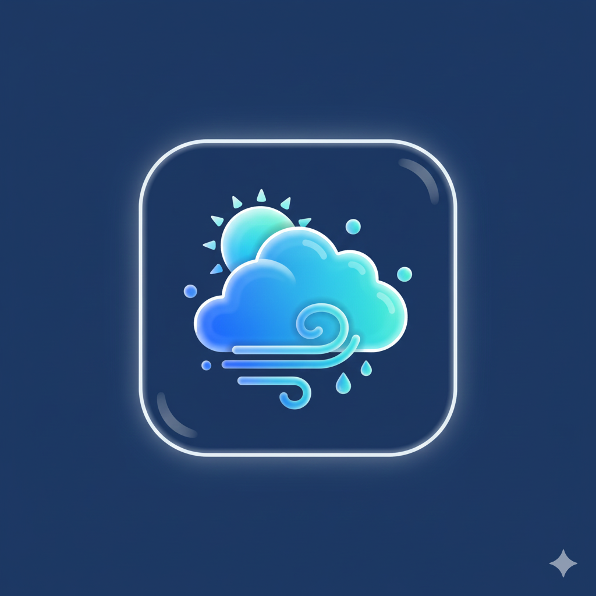

# 🌊 Liquid Glass Weather: North Texas Edition

A stunning, single-page weather application featuring a **Liquid Glass (Glassmorphism)** aesthetic. Tailored specifically for residents of **Canton** and **Dallas, Texas**, this app provides high-contrast, beautiful weather data with a "native app" feel.

## ✨ Features

- **Liquid Glass UI:** Modern frosted-glass panels with real-time backdrop-blur and deep-sea gradients.
- **Location Selector:** Instantly toggle between Canton, TX and Dallas, TX.
- **Comprehensive Data:**
  - Current Temperature & Conditions
  - High/Low for the day
  - Wind Speed, Humidity, and UV Index
  - Barometric Pressure
  - Sunrise/Sunset times
- **PWA Ready:** Optimized for "Add to Home Screen" on iOS and Android to function like a native mobile app.
- **Zero Jitter:** High-performance CSS ensures smooth scrolling even on older mobile devices.

## 🛠️ Technology Stack

- **HTML5:** Semantic structure.
- **CSS3:** Custom glassmorphism effects, hardware-accelerated gradients, and responsive grid layouts.
- **JavaScript:** Real-time DOM manipulation for location switching.
- **Lucide Icons:** Crisp, high-contrast vector icons.

## 📱 Mobile Installation

To use this as a full-screen app on your phone:

### iOS (Safari)
1. Open the GitHub Pages link in Safari.
2. Tap the **Share** button (square with an arrow).
3. Select **Add to Home Screen**.

### Android (Chrome)
1. Open the link in Chrome.
2. Tap the **three dots** (top right).
3. Select **Install App** or **Add to Home Screen**.

## 📍 Local Context
This app was designed for the specific needs of North Texas users, tracking the unseasonably warm December 2025 weather patterns affecting the Canton and Dallas areas.

---
*Created with care for the Canton community.*
